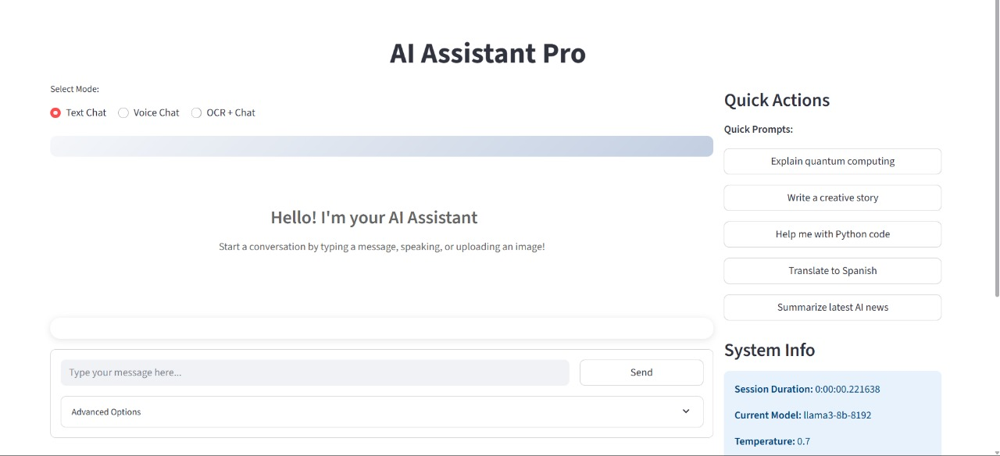
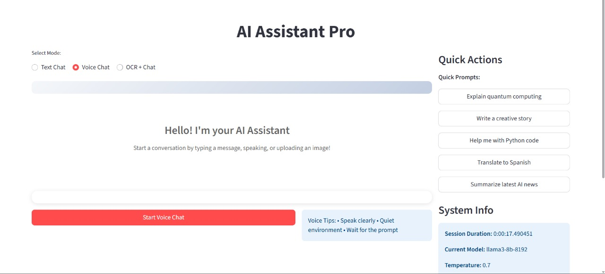
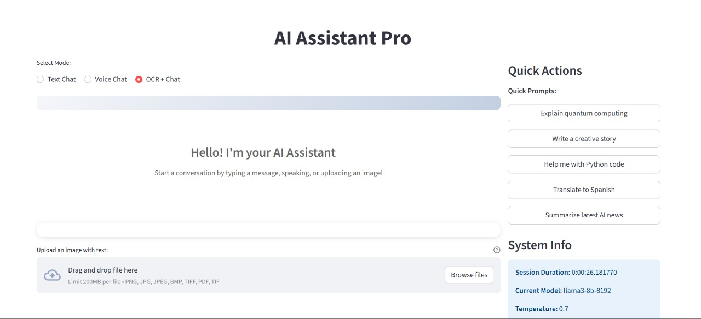
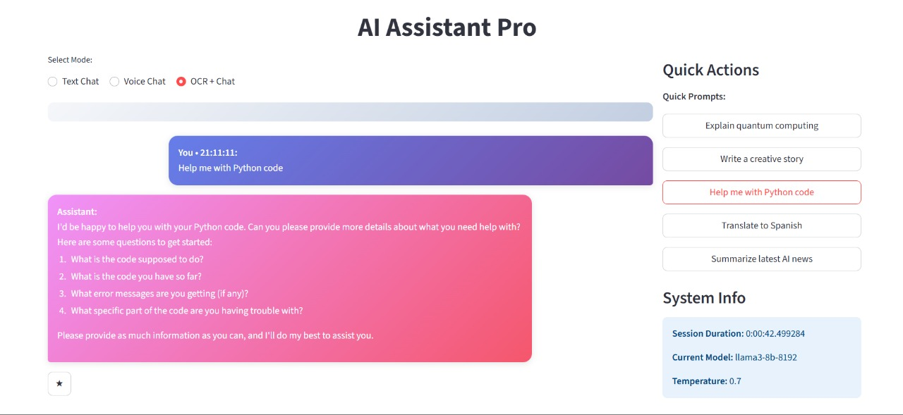
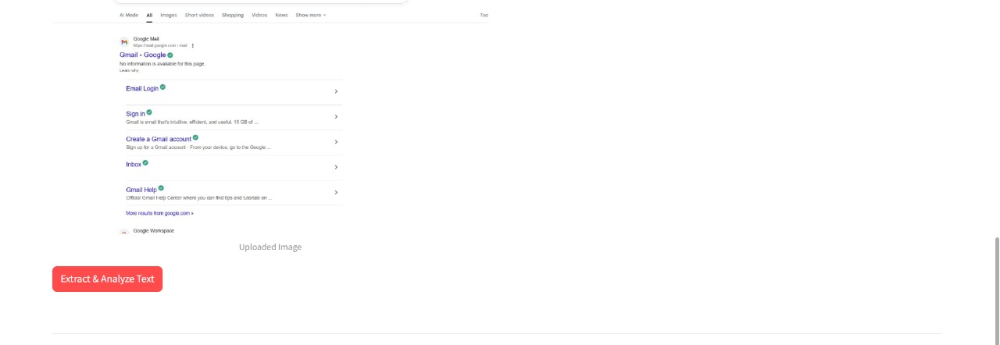

# AI Assistant Pro

## Overview
AI Assistant Pro is a web-based AI-powered application built with Streamlit. It integrates multiple functionalities to offer an interactive assistant experience including:
- **Text Chat:** Conversational interaction powered by AI.
- **Voice Chat:** Speak naturally and let the assistant respond.
- **OCR + Chat:** Upload images to extract and analyze text.
- **Favorites:** Save favorite interactions for quick reference.
- **Export Chat:** Export conversation history as JSON.

## Features
- **Multi-Modal Interaction:** Switch easily among text, voice, and OCR-based inputs.
- **Advanced OCR:** Uses multiple preprocessing techniques for high-accuracy text extraction.
- **Customizable AI Responses:** Select from different AI models and adjust parameters like creativity and response length.
- **Text-to-Speech (TTS):** Converts text responses to spoken words for a hands-free experience.
- **Session Statistics & System Info:** View current system status, session duration, and conversation counts.
- **Data Management:** Easily export or clear chat histories and manage favorite responses.

## Installation and Setup

1. **Clone the Repository:**

   ```sh
   git clone <repository-url>
   cd AI_assistant
   ```

2. **Create a Virtual Environment and Install Dependencies:**

   For Windows:
   ```sh
   python -m venv venv
   venv\Scripts\activate
   pip install -r requirements.txt
   ```

   For macOS/Linux:
   ```sh
   python3 -m venv venv
   source venv/bin/activate
   pip install -r requirements.txt
   ```

3. **Configure Environment Variables:**

   Create a `.env` file in the project root (do NOT commit your actual API key):

   ```env
   GROQ_API_KEY=<your_api_key_here>
   ```

4. **Install Tesseract OCR:**

   - Download and install [Tesseract OCR](https://github.com/tesseract-ocr/tesseract).
   - Update the Tesseract command path in [main.py](c:\Users\MR\OneDrive\Desktop\AI_assistant\main.py) if necessary:
     ```python
     pytesseract.pytesseract.tesseract_cmd = r"C:\Program Files\Tesseract-OCR\tesseract.exe"
     ```

## Usage

Launch the application using Streamlit:

```sh
streamlit run main.py
```

Once running, you can:

- **Chat:** Use the text input form for a conversation or click “Send” to see AI responses.
- **Voice Chat:** Start a voice session by clicking “Start Voice Chat” for speech recognition and response.
- **OCR + Chat:** Upload an image (or PDF) to extract text, then have the assistant summarize or analyze the extracted content.
- **Data Management:** Export your chat history as JSON or clear the conversation using the sidebar options.
- **Favorites:** Save favorite responses and quickly review them in the “Favorites” section.

## Project Structure

- **main.py:** The main application source code with the implementation of chat, voice recognition, OCR, TTS, export, and favorites.
- **requirements.txt:** Lists all Python dependencies required by the application.
- **.gitignore:** Configured to exclude sensitive files and temporary/development files.
- **Readme.md:** This documentation file.

## 📸 Screenshots

1. **Resume Upload Page**  
   

2. **Resume Preview & Analyze Button**  
   

3. **Skills & Grammar Analysis**  
   

4. **Section Detection & Score**  
   

5. **Downloadable Report**  
   

## Dependencies

- [Streamlit](https://streamlit.io/)
- [Pytesseract](https://pypi.org/project/pytesseract/)
- [OpenCV (opencv-python)](https://pypi.org/project/opencv-python/)
- [NumPy](https://numpy.org/)
- [Pillow](https://pillow.readthedocs.io/)
- [Groq](#) (API client for AI language models)
- [pyttsx3](https://pypi.org/project/pyttsx3/)
- [SpeechRecognition](https://pypi.org/project/SpeechRecognition/)
- [python-dotenv](https://pypi.org/project/python-dotenv/)

## License

This project is free to use.

## Additional Information
- **Settings & Customization:** Adjust AI model, creativity (temperature), and maximum response length from the sidebar.
- **System Info:** View live system status including TTS, OCR, and voice recognition readiness.
- **Support:** For further details or troubleshooting, refer to inline comments in the [main.py](c:\Users\MR\OneDrive\Desktop\AI_assistant\main.py) file.

Enjoy using AI Assistant Pro!
